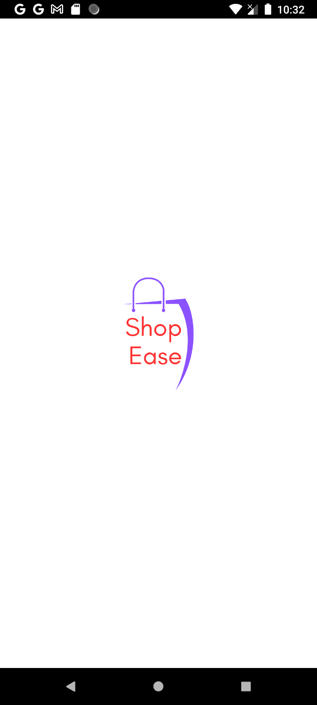
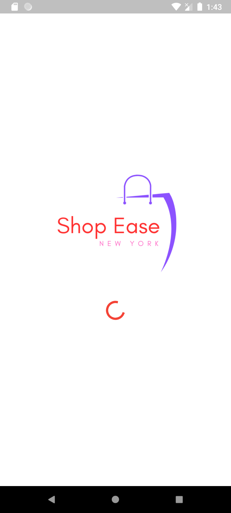
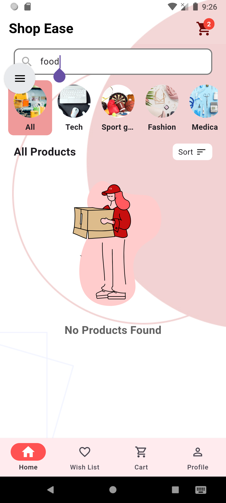
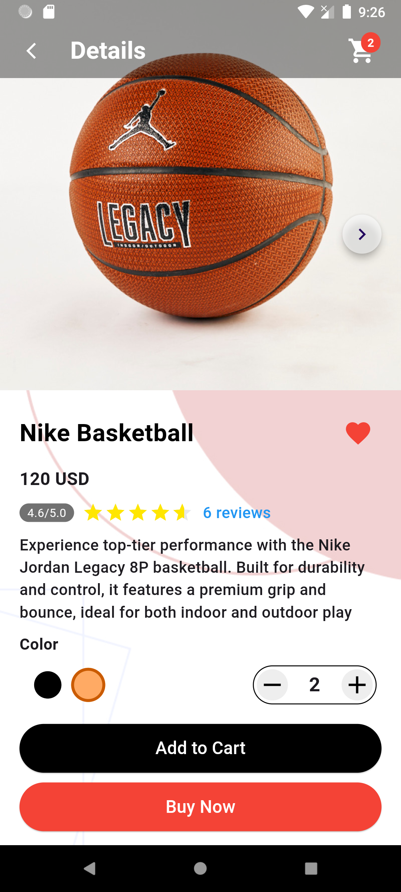
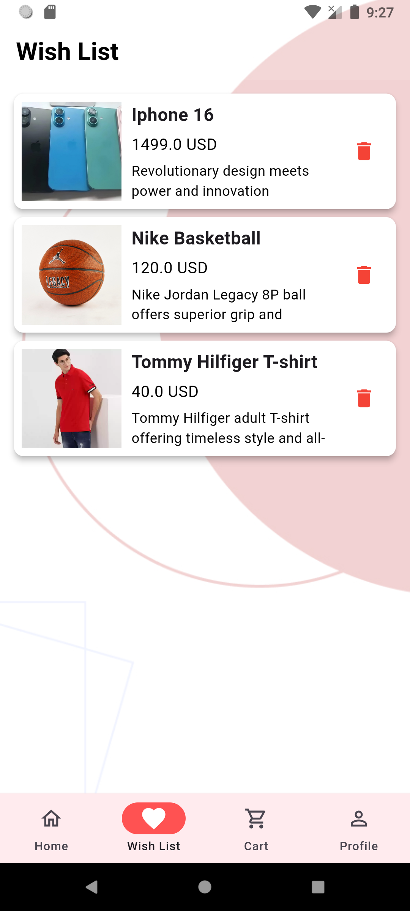
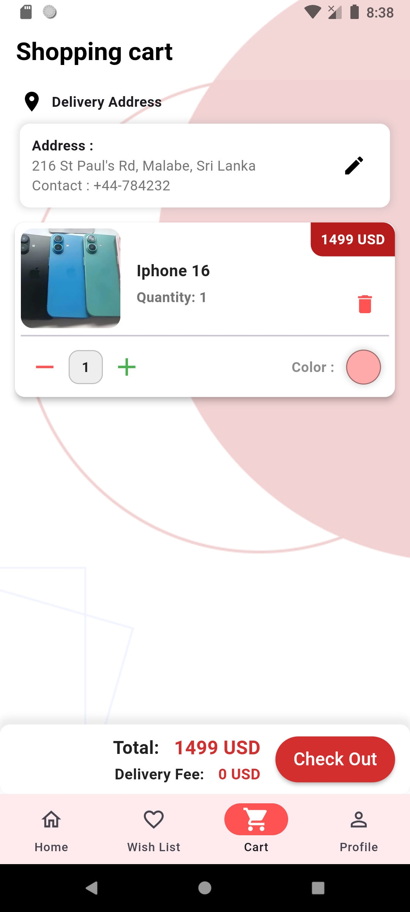
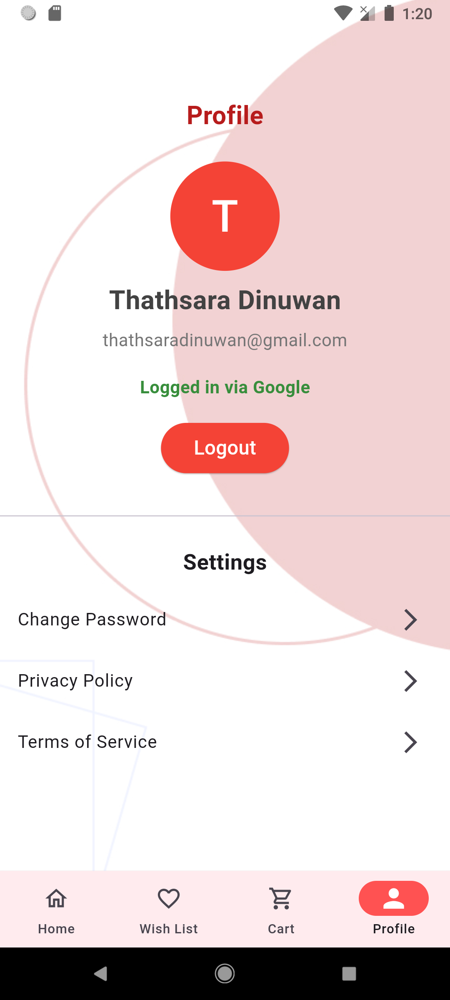
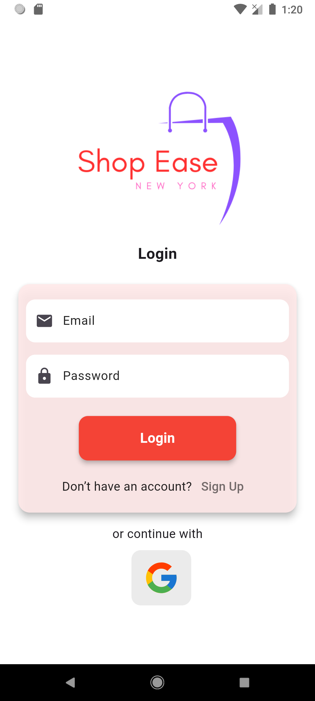
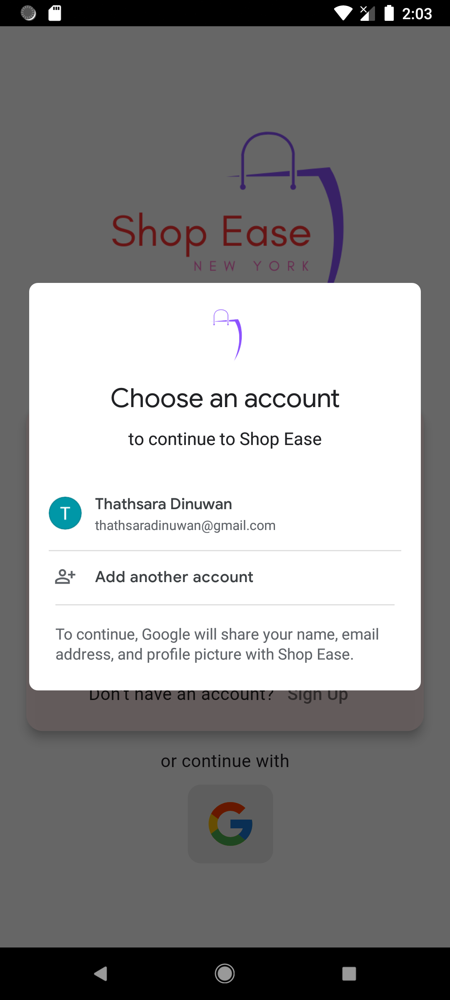

# 🛍️ Shopease New York

**Shopease New York** is an intuitive and user-friendly e-commerce mobile application designed to provide a seamless online shopping experience for customers. The app allows users to browse a wide range of products, from fashion and electronics to home goods, all curated for a modern shopping experience.

## 📌 Key Features:

- **Product Catalog**: Browse an extensive catalog of products, with detailed descriptions, images, and prices.
- **Search and Filter**: Easily search for products or filter them based on categories, price range, or brand.
- **User Accounts**: Create and manage user accounts, track orders, and save favorite items.
- **Shopping Cart**: Add items to the shopping cart, view item details, and proceed to checkout smoothly.
- **Wish List**: Add items users wish to buy in the future. easier in keeping a track of favorite items, their prices and stocks.
- **Push Notifications**: Stay updated on new arrivals, promotions, and order status through notification messages.

## 💻 Tech Stack:

- **Frontend**: Flutter
- **Backend**: Firebase for user authentication, database and notifications
- **Dependencies**: get, provider, connectivity plus, lottie, native splash, firestore, firebase core, firebase auth, firebase messaging

## Logo

.png)

## Screenshots

    
    
    
    
    
    
    
    
    
    

